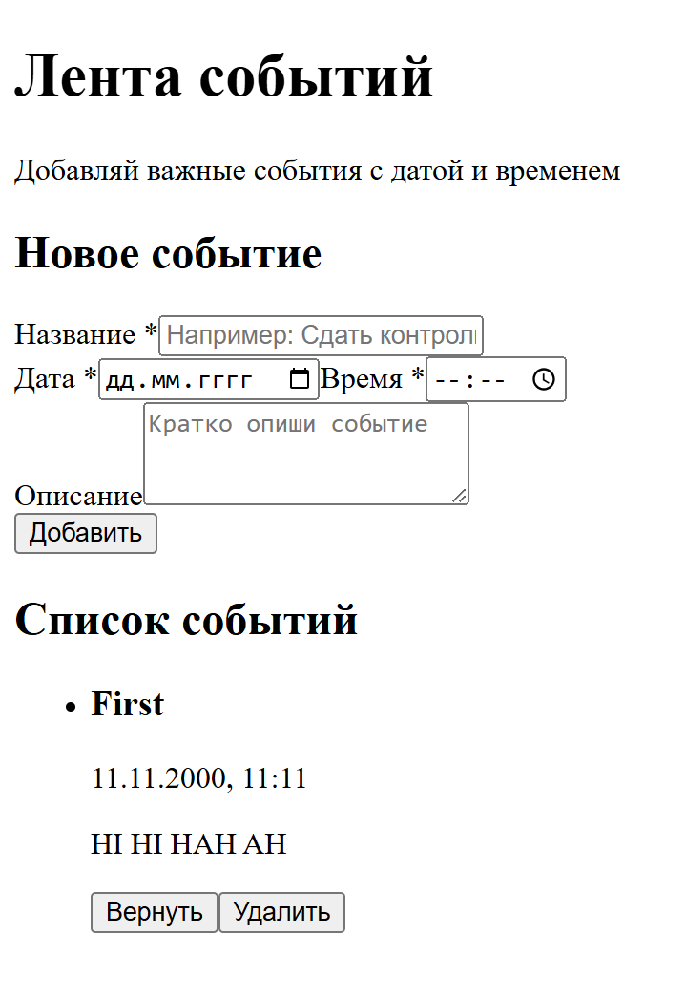

# Лента событий

React-приложение для добавления и просмотра событий с датой и временем.

## Основные возможности

- Добавление события с названием, датой, временем и описанием.
- Сортировка событий по дате и времени.
- Отметка события как выполненного / возвращение в список.
- Удаление события.
- Сохранение всех данных в `localStorage` (события не пропадают при перезагрузке страницы).
  
